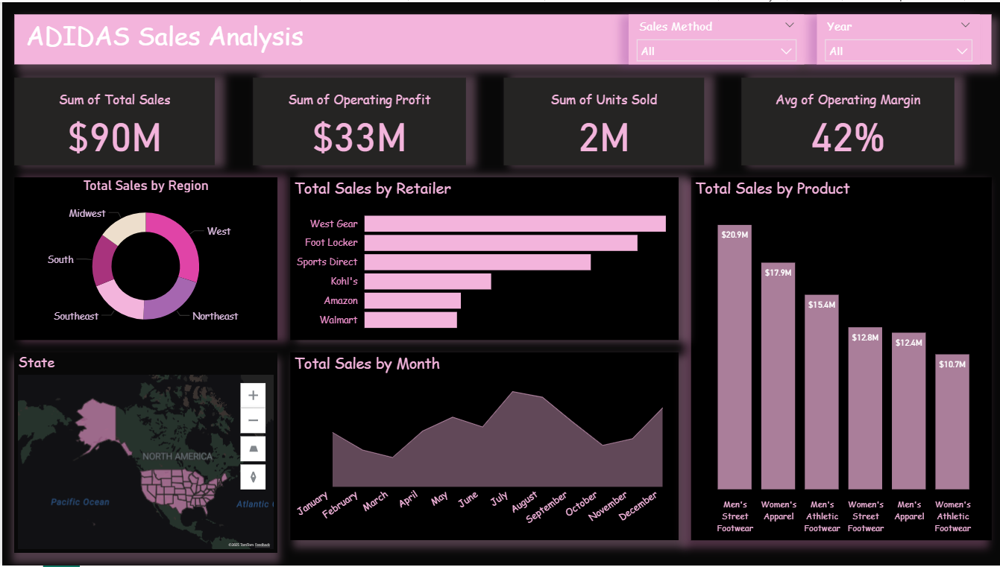

# Adidas-Sales-Analysis

## Overview
This project is an analysis of **Adidas sales data from 2020 to 2021** using **Power BI**.  
I wanted to understand how sales and profits changed across regions, retailers, and sales methods, and to find out which products and channels performed best.  

The dashboard gives an easy and interactive way to explore total sales, profit, units sold, and monthly performance trends.

---

## Key Insights

### 2020
- Total Sales: **$18M**, Profit: **$6M**  
- **West Gear** was the top retailer with **$9M** (around half of total sales)  
- **Top Products:** Men's street Footwear and Women's Apparel  
- **West Region:** $7M total sales (42%)
- April reached the highest sales (**$2M**), but sales dropped during May–July (~$1.7M)  
  > *The company started strong in Q2, but performance slowed down mid-year.*

---

### 2021
- Total Sales: **$72M**, Profit: **$27M**, and over **2M units sold**  
- **Foot Locker** led with **$18M** in sales  
- Sales increased significantly in summer compared to 2020  
  > *The brand expanded well — total sales grew by almost 300% compared to 2020.*

---

### Sales Methods (2020–2021)
| Sales Method | Total Sales | Profit |
|---------------|--------------|---------|
| **In-Store** | $36M | $13M |
| **Online** | $25M | $10M |
| **Outlet** | $30M | $11M |

> *In-store is still the biggest channel, but online and outlet sales are growing fast and bringing good profit margins.*

---

### Regional & Retail Insights
- The **West region** stayed the top performer in both years.  
- **Foot Locker** and **West Gear** were the best-performing retailers overall.  
- Locations with more retail stores consistently performed better — showing the brand’s strong physical presence.

---
## Dashboard Preview
  
